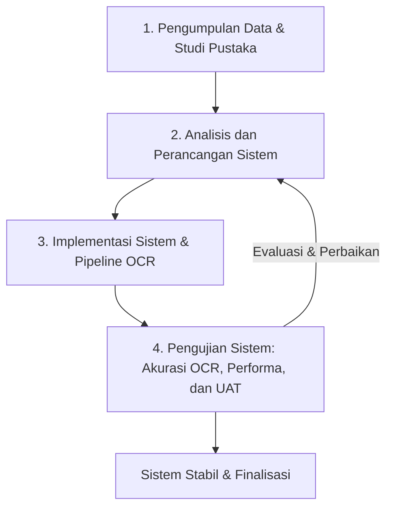

# BAB III
# METODE PENELITIAN

## 3.1. Alat dan Bahan

Pengembangan sistem analisis dan implementasi teknologi *Optical Character Recognition* (OCR) untuk digitalisasi dokumen *Daily Drilling Reports* (DDR) membutuhkan persiapan sarana pendukung yang terencana. Kelengkapan instrumen ini merupakan faktor penentu dalam menjamin kelancaran seluruh proses penelitian, mulai dari tahap rekayasa model hingga validasi antarmuka. Secara garis besar, sarana pendukung dalam penelitian ini diklasifikasikan menjadi dua kategori utama, yaitu peralatan (perangkat keras dan perangkat lunak) serta bahan penelitian. Setiap komponen memiliki peran khusus dalam mendukungan perancangan, pelaksanaan eksekusi alur kerja pemrosesan data, hingga pengujian sistem secara komprehensif.

### 3.1.1. Perangkat Keras

Perangkat keras yang diterapkan dalam penelitian ini berfungsi sebagai infrastruktur komputasi utama untuk melakukan pelatihan komparatif model OCR, mengeksekusi layanan *backend API* latar belakang (*background processing*), serta merender dasbor antarmuka web. Spesifikasi teknis perangkat keras yang digunakan selama proses pengembangan dan pengujian disajikan pada Tabel 3.1 berikut.

**Tabel 3.1. Spesifikasi Perangkat Keras Pengembangan dan Pengujian**

| Komponen | Spesifikasi / Keterangan |
|---|---|
| Tipe Komputer / Laptop | PC Workstation / Laptop High-Performance |
| Sistem Operasi | Windows 11 Home 64-bit / Linux Server Environment |
| Prosesor (CPU) | Multi-Core Processor (Intel Core i5 / AMD Ryzen 5 generasi terkini atau lebih tinggi) |
| Memori (RAM) | 16 GB DDR4/DDR5 (Guna mendukung rendering citra resolusi tinggi dan proses OCR serentak) |
| Kartu Grafis (GPU) | Terintegrasi / NVIDIA GeForce dengan akselerasi CUDA (Opsional untuk percepatan inferensi model) |
| Media Penyimpanan | 512 GB NVMe SSD |

### 3.1.2. Perangkat Lunak

Selain perangkat keras, pembangunan sistem ini ditopang oleh serangkaian perangkat lunak, kerangka kerja (*framework*), dan pustaka (*library*) modern. Tabel 3.2 merangkum daftar pustaka yang digunakan dalam implementasi *engine* OCR, pemrosesan tabular, penyimpanan basis data, serta pengembangan tampilan dasbor web. Pemilihan perangkat lunak ini didasarkan pada kebutuhan fungsional dan performa eksekusi sistem ekstraksi otomatis.

**Tabel 3.2. Daftar Perangkat Lunak dan Library Sistem**

| No | Library / Framework | Versi | Deskripsi Fungsi Utama |
|---|---|---|---|
| 1 | Python | 3.11+ | Bahasa pemrograman inti untuk pemrosesan *backend* dan integrasi *engine* OCR |
| 2 | PaddleOCR | 2.6.1.3 | *Engine* OCR utama berbasis *Deep Learning* untuk deteksi teks dan struktur tabel |
| 3 | PaddlePaddle | 2.6.2 | Kerangka kerja *Deep Learning* yang menjadi fondasi ekosistem PaddleOCR |
| 4 | EasyOCR | 1.7.2 | *Engine* OCR alternatif berbasis PyTorch yang digunakan pada tahap eksperimen komparatif |
| 5 | PyMuPDF (`fitz`) | 1.24+ | Pustaka untuk merender halaman PDF menjadi citra digital beresolusi 200 DPI |
| 6 | img2table | 2.0.0 | Pustaka deteksi batas tabel (*table bounding detection*) dari dokumen PDF ke format Excel |
| 7 | openpyxl | 3.1.5 | Pustaka manipulasi file `.xlsx` untuk menjalankan perataan lembar kerja (*sheet flattening*) |
| 8 | pandas | 2.3.3 | Pustaka analisis data tabular untuk pemindaian horisontal/vertikal dan pemilahan atribut |
| 9 | FastAPI | 0.136.1 | *Framework* web asinkron untuk menangani rute REST API dan pemrosesan latar belakang |
| 10 | Uvicorn | 0.47.0 | Server web *ASGI* performa tinggi untuk mengeksekusi layanan *backend* FastAPI |
| 11 | MySQL Connector | 9.7.0 | *Driver* resmi penghubung aplikasi Python dengan basis data relasional MySQL |
| 12 | Next.js | 16.2.6 | *Framework* React modern berbasis *App Router* untuk penyajian dasbor visualisasi web |
| 13 | React / React DOM | 19.2.4 | Pustaka antarmuka pengguna untuk membangun komponen grafik interaktif |
| 14 | Tailwind CSS | v4.0 | *Framework* CSS *utility-first* untuk styling antarmuka dasbor operasional yang responsif |

### 3.1.3. Bahan

Bahan penelitian yang diolah dan dianalisis dalam proyek akhir ini bersumber dari kebutuhan operasional nyata di industri pengeboran minyak dan gas. Bahan-bahan tersebut menjadi landasan informasi yang memandu setiap tahap rekayasa sistem agar tepat sasaran:

**a. Kebutuhan Operasional dan Observasi Lapangan**  
Berdasarkan hasil observasi dan analisis kebutuhan pada **PT. Parama Data Unit**, diketahui bahwa pengolahan laporan pengeboran harian (*Daily Drilling Reports*) secara manual memakan waktu yang lama dan berisiko tinggi terhadap kesalahan ketik (*human error*). Operator membutuhkan sebuah sistem digital terpusat yang mampu membaca laporan berbentuk berkas pindaian/PDF secara otomatis dan langsung menampilkan ringkasan parameter pengeboran dalam dasbor yang intuitif.

**b. Dokumen Laporan Pengeboran (*Daily Drilling Reports*)**  
Dokumen utama yang menjadi objek analisis adalah berkas *Daily Drilling Reports* (DDR) berformat PDF. Dokumen ini merekam parameter teknis operasi sumur pengeboran selama siklus 24 jam. Sebanyak 13 sampel dokumen PDF DDR operasional asli dari PT. Parama Data Unit dikumpulkan dan dinormalisasi untuk dijadikan dataset pengujian evaluasi model OCR serta pengujian akurasi pemrosesan tabel.

**c. Skema Target Ekstraksi (*Dictionary Schema*)**  
Sebagai acuan rekonstruksi data tabular, disusun skema kamus ekstraksi parameter (*DATA_STRUCTURE*) yang merepresentasikan struktur logis dokumen DDR. Skema ini mencakup pembagian blok informasi ke dalam empat entitas utama: metadata sumur (*Well Profile*), parameter teknis pengeboran (*Drilling Parameters*), catatan pemakaian mata bor (*Bit Records*), serta rincian kronologi aktivitas per jam (*Time Breakdown*).

---

## 3.2. Tahapan Penelitian

Penelitian ini diimplementasikan dengan mengadopsi pendekatan siklus iteratif (*Iterative Waterfall*). Metode ini memungkinkan adanya evaluasi, perbaikan, dan penyesuaian berkelanjutan pada setiap tahapan pembangunan sistem. Apabila pada tahap pengujian ditemukan adanya deviasi akurasi atau kendala pemrosesan pada format tabel tertentu, maka proses dapat dikembalikan ke tahap analisis atau implementasi alur kerja guna melacak perbaikan algoritma tanpa merombak total arsitektur. Diagram alur tahapan penelitian disajikan pada Gambar 3.1 berikut.

**Gambar 3.1.** Alur Tahapan Penelitian

### 3.2.1. Pengumpulan Data

Pada tahap pengumpulan data, dilakukan dua aktivitas utama. Pertama, studi literatur secara komprehensif terhadap publikasi ilmiah, laporan teknis, dan dokumentasi resmi mengenai efektivitas model OCR (*PaddleOCR* dan *EasyOCR*) serta algoritma pengenalan tata letak tabel pada dokumen berstruktur rumit. Kedua, pengumpulan 13 sampel dokumen PDF *Daily Drilling Reports* dari PT. Parama Data Unit. Terhadap 13 sampel dokumen tersebut, dilakukan transkripsi manual untuk menghasilkan berkas referensi kebenaran absolut (*Ground Truth Text*). Berkas *Ground Truth* ini kelak menjadi standar penilai matematis untuk mengukur tingkat akurasi pembacaan karakter dan kata dari masing-masing model OCR yang diuji.

### 3.2.2. Analisis dan Perancangan Sistem

Sistem ekstraksi dan visualisasi dokumen DDR dirancang menggunakan arsitektur *3-tier* modern yang memisahkan lapisan penyajian antarmuka (*frontend*), lapisan logika pemrosesan bisnis (*backend API*), dan lapisan penyimpanan data (*database*). 

Pada lapisan *backend*, sistem tidak hanya bertindak sebagai penerima berkas, tetapi diperkuat oleh mekanisme pemrosesan latar belakang (*background task*) menggunakan FastAPI. Saat operator mengunggah dokumen PDF, sistem menerima berkas secara asinkron dan segera memberikan respons status, sementara tugas pembacaan OCR, ekstraksi tabel, dan normalisasi matriks berjalan di latar belakang tanpa memblokir antarmuka pengguna. Data hasil ekstraksi yang telah tervalidasi kemudian disalurkan ke basis data relasional **MySQL**.

Pada lapisan antarmuka pengguna (*frontend*), sistem dirancang untuk mengakomodasi kebutuhan operator dan administrator PT. Parama Data Unit. Melalui antarmuka berbasis web **Next.js**, pengguna dapat memantau status pemrosesan dokumen, melihat detail setiap sumur pengeboran (*Well Pad Overview*), menganalisis proporsi waktu operasional melalui grafik interaktif (*Donut Chart Productive vs Non-Productive Time*), serta melacak kemajuan pengeboran sumur melalui kurva kedalaman (*Depth Progress Chart*).

### 3.2.3. Implementasi Sistem

Tahap implementasi merupakan proses pengkodean (*coding*) rancangan arsitektur ke dalam alur pemrosesan nyata. Implementasi sistem dibagi menjadi tiga tahapan teknis yang saling terintegrasi:

1. **Pra-pemrosesan dan Eksperimen Komparasi OCR:**  
   Setiap halaman dokumen PDF masukan dikonversi terlebih dahulu menjadi citra digital beresolusi terstandar 200 DPI menggunakan pustaka `PyMuPDF (fitz)`. Pada fase komparasi model, citra tersebut diproses secara terisolasi menggunakan *engine* **PaddleOCR** dan **EasyOCR**. Hasil keluaran teks mentah dari kedua model dibandingkan dengan berkas *Ground Truth* menggunakan pustaka `jiwer` untuk mendapatkan nilai *Character Error Rate* (CER), *Word Error Rate* (WER), dan *F1-Score*. Model dengan performa terbaik dan akurasi tertinggi dipilih sebagai mesin utama di dalam sistem.

2. **Ekstraksi Tabel dan Perataan Matriks (*Sheet Flattening*):**  
   Untuk menangani dokumen DDR yang sarat akan tabel kompleks dan penggabungan sel (*merged cells*), alur pemrosesan menerapkan pustaka `img2table` dengan *engine* PaddleOCR guna memetakan kotak pembatas tabel dan mengekspornya ke format buku kerja Excel (`.xlsx`). Selanjutnya, skrip pemroses mengeksekusi algoritma *sheet flattening* berbantuan pustaka `openpyxl`. Seluruh *merged cells* dibongkar dan nilainya didistribusikan secara merata ke dalam satu lembar kerja datar bertajuk `"Data Flat"`. Normalisasi ini menghilangkan celah baris/kolom kosong yang sering merusak alur pembacaan mesin konvensional.

3. **Pemindai Arah dan Pemilahan Atribut (*Directional Scanning & Parsing*):**  
   Matriks lembar kerja `"Data Flat"` dibaca menggunakan `pandas` *DataFrame*. Skrip `simple_extractor.py` memindai matriks tersebut melalui tiga pendekatan pola:
   - *Horizontal Scanning:* Menelusuri sel secara mendatar untuk mengidentifikasi label kunci beserta nilai di sel sampingnya (contoh: *Well Name*, *Spud Date*, *Present Depth*).
   - *Vertical Scanning:* Mengekstraksi blok teks naratif seperti ringkasan insiden lapangan (*Accident/Incident Summary*).
   - *Regular Expression Parsing:* Menelusuri matriks tabel *Time Breakdown* baris per baris menggunakan pola RegEx untuk memisahkan rentang jam awal, jam akhir, durasi, kedalaman, kode aktivitas, klasifikasi *Productive/Non-Productive Time* (PT/NPT), serta uraian aktivitas operasi.

Seluruh data yang telah diekstrak dan dinonaktifkan deraunya diubah ke struktur JSON lalu diunggah ke dalam empat tabel relasional MySQL (`ddr_documents`, `ddr_fields`, `ddr_time_breakdown`, dan `ddr_bit_records`). Antarmuka **Next.js 16** kemudian mengambil data terstruktur ini melalui *REST API endpoints* untuk disajikan pada dasbor analitik.

### 3.2.4. Pengujian Sistem

Setelah seluruh implementasi alur kerja dan antarmuka selesai dibangun, tahap akhir adalah pengujian sistem. Pengujian dilakukan secara menyeluruh guna memverifikasi keandalan teknis, ketepatan pembacaan model OCR, serta tingkat penerimaan pengguna operasional. Dalam menunjang proses perhitungan performa dan akurasi, digunakan beberapa pustaka perangkat lunak pengujian yang tercantum pada Tabel 3.3.

**Tabel 3.3. Spesifikasi Perangkat Lunak untuk Pengujian Sistem**

| Nama Modul / Library | Versi | Keterangan Fungsi Pengujian |
|---|---|---|
| Python | 3.11+ | Lingkungan eksekusi skrip evaluasi pengujian |
| jiwer | 4.0.0 | Pustaka NLP untuk menghitung metrik CER, WER, dan komputasi akurasi |
| time (Python Built-in) | - | Modul pengukur durasi waktu eksekusi pemrosesan dokumen API |
| psutil | 7.0+ | Pustaka pemantau beban komputasi dan konsumsi memori sistem |
| re (Regular Expression) | - | Modul evaluasi ketepatan pemilahan pola teks pada tabel *Time Breakdown* |

Pengujian sistem dalam penelitian ini terbagi ke dalam tiga fokus evaluasi:

1. **Pengujian Akurasi Model OCR (*Accuracy Testing*):**  
   Pengujian ini mengukur presisi pembacaan karakter dan kata model OCR terhadap 13 sampel dokumen DDR asli. Nilai kesalahan dihitung menggunakan Persamaan matematis *Character Error Rate* (CER) dan *Word Error Rate* (WER), sedangkan kelengkapan pembacaan token diukur melalui metrik *F1-Score*.

2. **Pengujian Performa Ekstraksi dan Respons API (*Performance Testing*):**  
   Pengujian ini bertujuan mengetahui latensi dan beban sumber daya server saat memproses dokumen di latar belakang. Durasi waktu proses dihitung menggunakan modul `time` dengan mengurangkan waktu selesai pemrosesan (`end_time`) terhadap waktu mulai eksekusi (`start_time`) pada *background task* FastAPI. Secara bersamaan, konsumsi memori puncak (*peak memory usage*) dipantau menggunakan pustaka `psutil`.

3. **Pengujian Penerimaan Pengguna (*User Acceptance Testing / UAT*):**  
   Pengujian UAT dilaksanakan untuk memvalidasi kesesuaian fungsionalitas antarmuka web dasbor dengan kebutuhan praktis operator di PT. Parama Data Unit. Pengujian dilakukan dengan meminta responden (staf/operator) menjalankan skenario pengoperasian sistem, mulai dari mengunggah dokumen DDR, memantau proses latar belakang, memeriksa tabel hasil ekstraksi, hingga mengevaluasi grafik *Donut Chart* dan *Depth Progress*. 
   
   Setelah mencoba sistem, responden mengisi kuesioner evaluasi menggunakan skala Likert 1 hingga 5 (1 = Sangat Tidak Setuju, 2 = Tidak Setuju, 3 = Netral, 4 = Setuju, 5 = Sangat Setuju). Pernyataan instrumen pengujian UAT yang digunakan untuk mengevaluasi kelayakan sistem disajikan pada Tabel 3.4 berikut.

**Tabel 3.4. Instrumen Pengujian *User Acceptance Testing* (UAT) Operator PT. Parama Data Unit**

| No | Pernyataan Evaluasi Fungsionalitas dan Antarmuka Sistem | 1 | 2 | 3 | 4 | 5 |
|---|---|---|---|---|---|---|
| 1 | Alur pengoperasian sistem dari proses unggah dokumen PDF hingga visualisasi dasbor mudah dipahami | | | | | |
| 2 | Proses pengunggahan dokumen *Daily Drilling Reports* (DDR) berjalan dengan lancar tanpa kendala teknis | | | | | |
| 3 | Pemrosesan latar belakang (*background processing*) OCR memberikan respons waktu yang wajar dan informatif | | | | | |
| 4 | Hasil ekstraksi parameter informasi (*Well Profile*, *Drilling Parameters*, *Bit Records*) terurai secara rapi dan akurat | | | | | |
| 5 | Pemilahan aktivitas operasi per jam (*Time Breakdown*) ditampilkan secara terstruktur dan memudahkan verifikasi data | | | | | |
| 6 | Visualisasi grafik analisis proporsi waktu (*Donut Chart PT/NPT*) sangat membantu dalam pemantauan efisiensi operasi pengeboran | | | | | |
| 7 | Grafik perkembangan kedalaman sumur (*Depth Progress Chart*) menyajikan informasi kronologis pengeboran dengan jelas | | | | | |
| 8 | Tata letak antarmuka dasbor web terlihat rapi, modern, dan nyaman untuk digunakan | | | | | |
| 9 | Sistem aplikasi web ini secara keseluruhan mempercepat proses digitalisasi dan efisiensi pengarsipan data laporan di PT. Parama Data Unit | | | | | |
